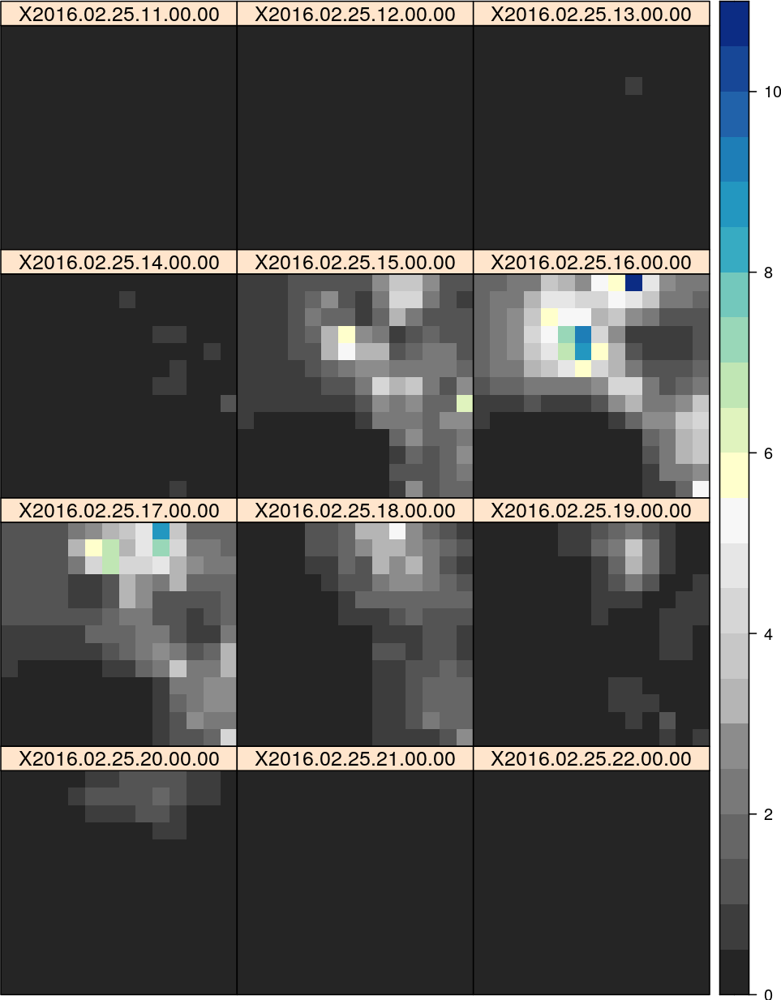

# hourlyPrecMerge_rcl

A simple framework to develop an hourly gridded precipitation product for Chillon, Rimac and Lurin basins (CHIRILU).

  

*Figure. Hourly precipitation (mm) for the an event according to the median value between 8 methods (IDW, OK, RIDW, RIDW2, RK2, RK, CM_IDW and CM_OK) in CHIRILU (12.3°S-11.0°S and 77.2°W-76.0°W).*
